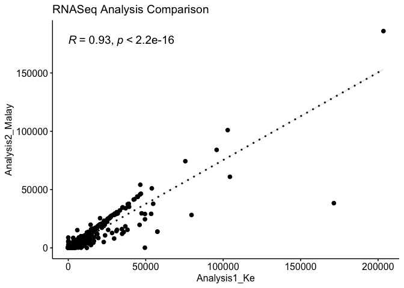
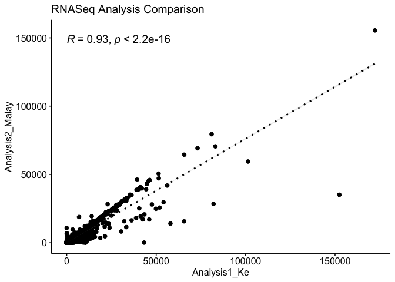

R, load two clean matrix, join together, and then plot
======================================================

``` r
for (i in 8:9){
  KeArray = read.delim(paste0('/Users/tanke/RStudio/CleanCounts.MouseAlignment_Sample',i,'_S0.txt'),header = TRUE, sep = '', dec = '.')
  MalayArray = read.delim(paste0('/Users/tanke/RStudio/CleanCounts_MalayRSEM_MouseAlignment_Sample',i,'.txt'),header = TRUE, sep = '', dec = '.')
  InnerJoin <- dplyr::inner_join(KeArray,MalayArray,by='Geneid')
  KeCount = InnerJoin[,2]
  MalayCount = InnerJoin[,3]
  library("ggpubr")
  print(ggscatter(InnerJoin, x = "count.x", y = "count.y", 
          add = "reg.line", 
          add.params = list(color = "black", fill = "lightgray", linetype = 3),
          conf.int = TRUE, 
          cor.coef = TRUE, cor.method = "pearson",
          cor.coef.size = 5,
          xlab = "Analysis1_Ke", ylab = "Analysis2_Malay",
          title = 'RNASeq Analysis Comparison'))
}
```

    ## Loading required package: ggplot2

    ## `geom_smooth()` using formula 'y ~ x'



    ## `geom_smooth()` using formula 'y ~ x'


