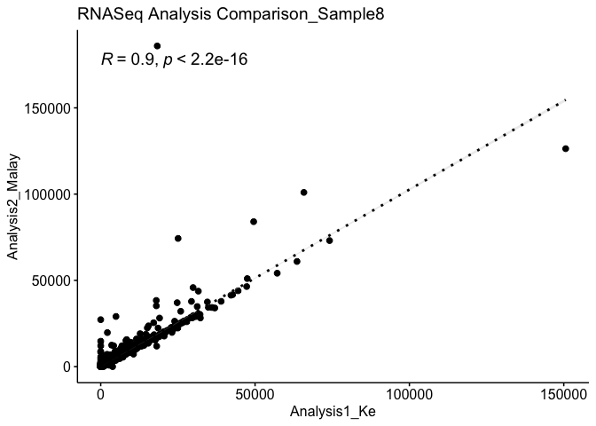
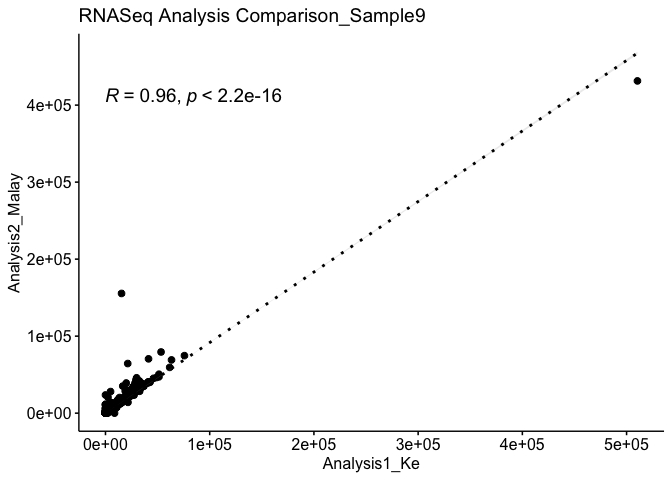

Bash, on clusters
-----------------

Download Mus Musculus genome from iGenome using wget, and then unzip
(reference:
<a href="https://www.interserver.net/tips/kb/extract-tar-gz-files-using-linux-command-line/" class="uri">https://www.interserver.net/tips/kb/extract-tar-gz-files-using-linux-command-line/</a>)

    wget http://igenomes.illumina.com.s3-website-us-east-1.amazonaws.com/Mus_musculus/NCBI/GRCm38/Mus_musculus_NCBI_GRCm38.tar.gz
    tar xvzf Mus_musculus_NCBI_GRCm38.tar.gz

Run STAR genome index generator to create genome indices Warning: uses
high RAM sjdbOverhang = sequence length - 1 -n 1 -c 5 -m 24g Warning:
module purge at first, so that you can use STAR module

FIXME: look for the newest conda version of STAR

    module load STAR/2.7.1a-foss-2016b; STAR --runThreadN 5 --runMode genomeGenerate --genomeDir GenomeIndices --genomeFastaFiles genome.fa --sjdbGTFfile genes.gtf --sjdbOverhang 100

Align reads Check the input (zipped or not!) and output!! Time: \~4min
for one sample Output size: \~2GB module purge

    module load STAR/2.7.1a-foss-2016b; for i in {8,9}; do STAR --genomeDir GenomeIndices --runThreadN 20 --readFilesIn SeqData/${i}_R1_output_forward_paired.fq SeqData/${i}_R2_output_reverse_paired.fq --outFileNamePrefix ReadAlignment/Sample${i} --outSAMtype BAM SortedByCoordinate --outSAMattributes Standard; done

Count features Apparently, the gtf file downloaded from iGenome is not
compatible with featureCounts, fixed the format (reference:
<a href="https://www.biostars.org/p/173233/" class="uri">https://www.biostars.org/p/173233/</a>)

FIXME: module purge, but you need conda here…

Time: \~20 seconds for one sample You don’t need clusters here, but pay
attention to threads s=0 is best here (Sarah’s criteria, but why?)

    perl -ne 'chomp; @a=split/\t/; %h=split(/ /,$a[8]); $a[8]=join(" ",("gene_id",$h{"gene_id"},"transcript_id",$h{"transcript_id"})); print join("\t",@a),"\n";' genes.gtf > genes_fixed.gtf

    for j in {0,1,2}; do for i in {8,9}; do featureCounts -p -a genes_fixed.gtf -g gene_id -t exon -o FeatureCounts/FeatureCounts_Sample${i}_S${j}.txt -s ${j} -T 20 ReadAlignment/Sample${i}Aligned.sortedByCoord.out.bam; done; done

Clean up featurecount matrix for R plotting and manually remove the
information at the beginning, and change header of count… there are 448
more lines than Malay’s analysis due to transcript\_id

    for i in {8,9}; do cut -f 1,7 FeatureCounts_Sample${i}_S0.txt > CleanFeatureCounts_Sample${i}_S0.txt; done
    for i in {8,9}; do grep -v 'transcript_id' CleanFeatureCounts_Sample${i}_S0.txt > CleanFeatureCounts_Sample${i}_S0_fixed.txt; done

R for comparison and plotting
-----------------------------

``` r
for (i in 8:9){
  KeArray = read.delim(paste0('/Users/tanke/RStudio/CleanFeatureCounts_Sample',i,'_S0_fixed.txt'),header = TRUE, sep = '', dec = '.')
  MalayArray = read.delim(paste0('/Users/tanke/RStudio/CleanCounts_MalayRSEM_MouseAlignment_Sample',i,'.txt'),header = TRUE, sep = '', dec = '.')
  InnerJoin <- dplyr::inner_join(KeArray,MalayArray,by='Geneid')
  KeCount = InnerJoin[,2]
  MalayCount = InnerJoin[,3]
  library("ggpubr")
  print(ggscatter(InnerJoin, x = "count.x", y = "count.y", 
          add = "reg.line", 
          add.params = list(color = "black", fill = "lightgray", linetype = 3),
          conf.int = TRUE, 
          cor.coef = TRUE, cor.method = "pearson",
          cor.coef.size = 5,
          xlab = "Analysis1_Ke", ylab = "Analysis2_Malay",
          title = paste0('RNASeq Analysis Comparison_Sample',i)))
}
```

    ## Loading required package: ggplot2

    ## `geom_smooth()` using formula 'y ~ x'



    ## `geom_smooth()` using formula 'y ~ x'


